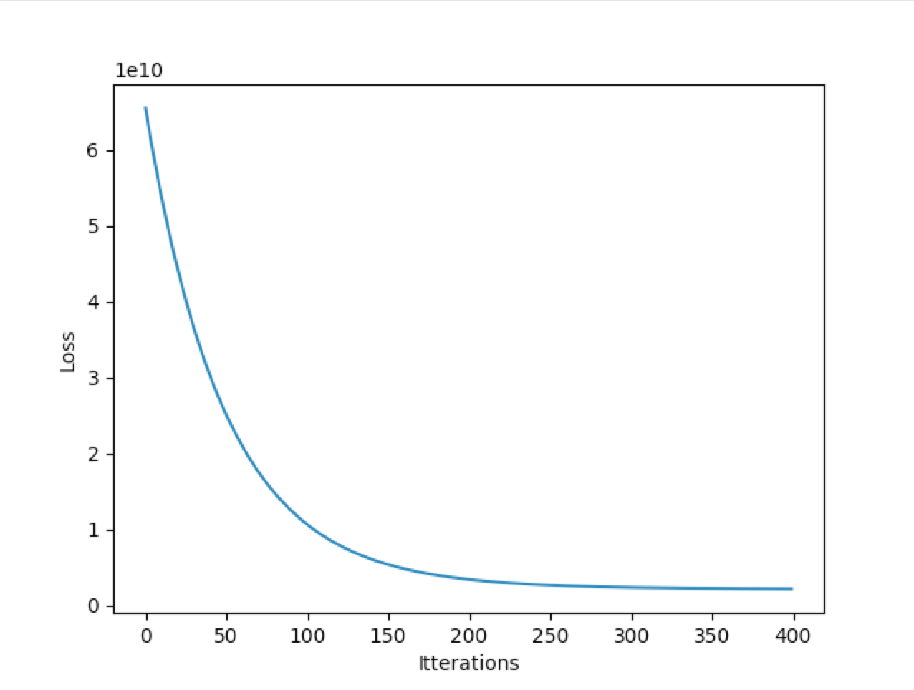

## Linear Regression - Multiple Varibales
This repository contains the code for Linear Regression with multiple variables. We will use it to predict the house prices

**Below are the steps:**

#### Step 1 - Load the Data
Data is inside **data.txt**. The first column is the population of a city and the second column is the profit of a food truck in that city. 
A negative value for profit indicates a loss.

#### Step 2 - Normalise the data
This is a data pre-processing step. In our dataset house sizes are about 1000 times the bedrooms, so we standardise the features which can make ths gradient descent converge quickly.

#### Step 2 - Loss Function
Loss function measures the difference between the predicted value and the actual value.
Here we use "mean squared error" function. Our Aim is to minimise loss.

#### Step 3 - Gradient Descent
Loss is minimised with gradient descent. Here we update our weights (**Theta**)

#### Step 4 - Set Hyperparameters and initialise weights
Set the following hyperparameters in **main.py** :

    learning_rate  
    total_iters

**Initialise the weights to zero**

#### Step 5 - Run main.py

    Itterations: 400
    learning rate: 0.01
    

